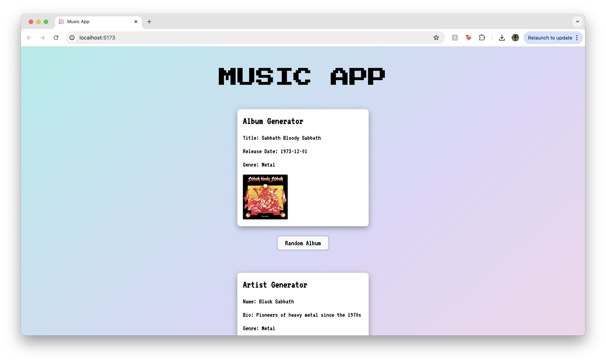
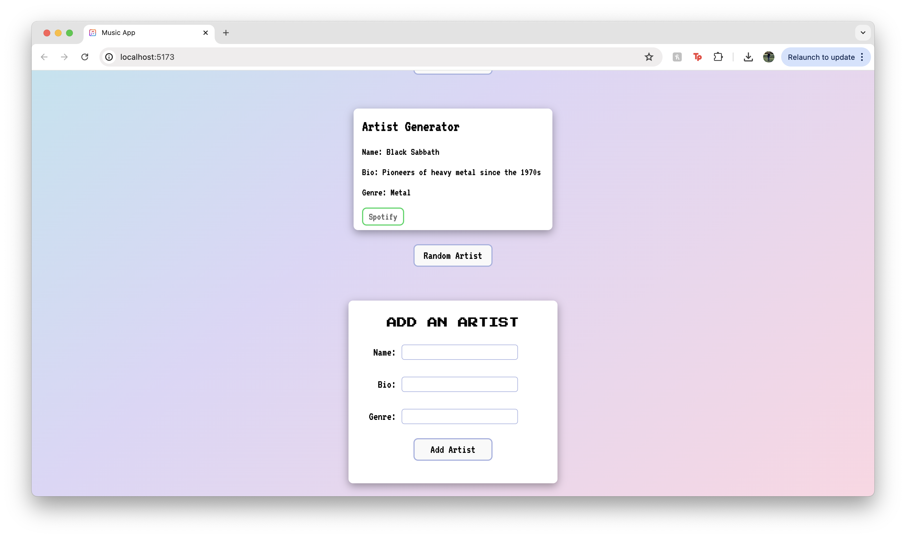
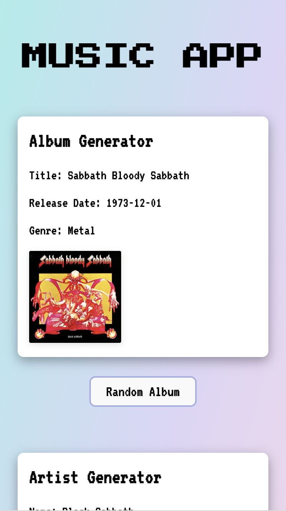
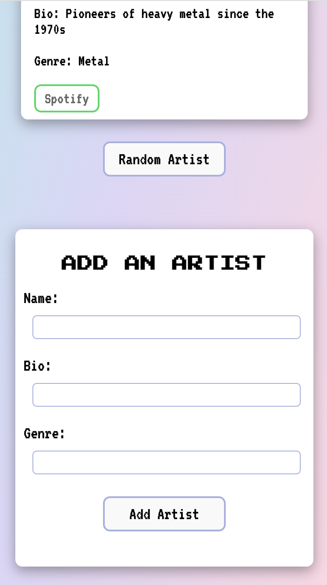

# Full-Stack Music App

A responsively-designed music app I created to demonstrate my full-stack development knowledge.

## Project Description

This full-stack music app includes:

- A frontend created using React + Vite
- A music API created using Node.js and Express.js
- A PostgreSQL database created using Postbird

## Hosting

- The React frontend is hosted using Netlify
- The Express API is hosted using Render
- The PostgreSQL database is hosted using Supabase

## Screenshots

Desktop:

{width=250px}

{width=250px}

Mobile:

## Technologies used

- React + Vite
- JSX
- CSS
- Netlify
- Node.js
- Express.js
- Render
- HTTP Requests, Middleware, Route handlers
- SQL
- PostgreqSQL
- Netlify
- Render
- Supabase
